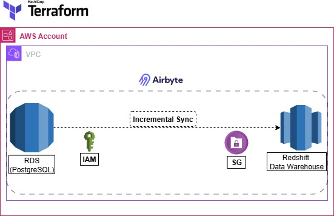

# Tradewaves Data Pipeline

This project demonstrates a production-style ETL pipeline built on modern data engineering tools.

- **Infrastructure**: Provisioned with Terraform on AWS.

- **Orchestration**: Airbyte, deployed within a Minikube cluster.

- **Source System**: Amazon RDS PostgreSQL (transactional data).

- **Destination**: Amazon Redshift (analytics warehouse).

The pipeline continuously replicates operational data from RDS into Redshift, ensuring that analytics teams always have access to fresh, reporting-ready datasets. This setup models how real-world companies sync application databases with cloud data warehouses for reporting, BI, and decision-making.


# Architecture



Amazon RDS PostgreSQL – Transactional database (source)

Airbyte on Minikube – Replication service (incremental sync)

Amazon Redshift – Analytics warehouse (destination)

Terraform – Infrastructure as Code (IaC) (VPC, subnets, security groups, IAM, RDS, Redshift)


# Terraform-Powered Infrastructure Deployment

Infrastructure provisioning code is organized within the `infrastructure/`.

To deploy:

```bash
cd airbyte-rds-redshift/infrastructure
terraform init
terraform plan
terraform apply
```

# Resources Provisioned

| Category       | Resources Provisioned                                     |
| -------------- | -------------------------------------------------------   |
| **Networking** | VPC, Public and Private Subnets, Subnet Groups            |
| **Security**   | Security Groups (least-privilege), IAM Roles and Policies |
| **Databases**  | Amazon RDS PostgreSQL, Amazon Redshift Cluster            |
| **Warehouse**  | Amazon Redshift Cluster                                   |


# Deploying Airbyte on Minikube

The deployment uses Minikube to run Airbyte locally. This approach provides a lightweight environment that is both portable and reproducible across different systems.


# Start Minikube

```bash
minikube start
kubectl create namespace airbyte
```

# Install Airbyte via Helm

```bash
helm repo add airbyte https://airbytehq.github.io/helm-charts
helm repo update
helm upgrade --install airbyte airbyte/airbyte -n airbyte
```


# Access the User Interface

```bash
kubectl -n airbyte port-forward svc/airbyte-webapp-svc 8000:80
```

Then open http://localhost:8000.


# Configuring the RDS → Redshift Connection

+ Create a Postgres source in Airbyte using the RDS endpoint, user, and password.
+ Create a Redshift destination using the cluster endpoint and credentials.
+ Select Incremental Sync with Deduped History as the replication strategy.
+ Run the connection to replicate data from RDS into Redshift.
